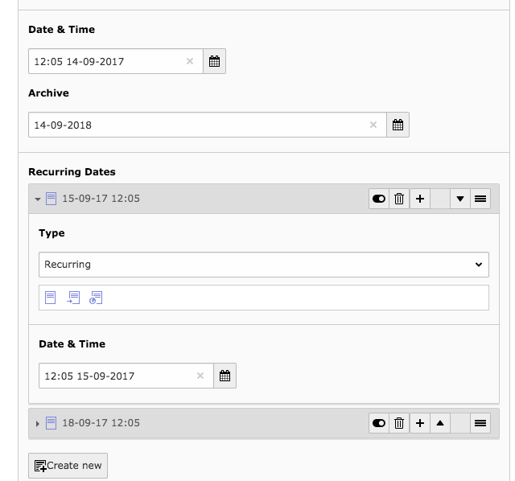

TYPO3 Extension `news_recurring`
================================

This extension provides an easy way to add multiple dates to a single news record.

Even though a recurring news event is a new record, it will be shown as a duplicate of the original one, except the date is switched to the actual one.



# Requirements

- TYPO3 12/13 LTS
- Extension `news` 12


# How to use

## Installation

Install the extension by using composer `composer require georgringer/news-recurring` or install it via Extension Manager.

## Usage

When creating a new news record, you can add multiple dates as relation to it.

In the template some additional properties are available which might be useful

```html
<!--This property will give you the original uid
    because by just fetching ``{newsItem.uid}`` the uid of the parent object will be shown.
-->
({newsItem.recurringOriginal}

<!--This property will get you the parent object-->
{newsItem.recurringParent}

<!--This property will give you all recurring events which are attached.-->
{newsItem.recurring}
```
